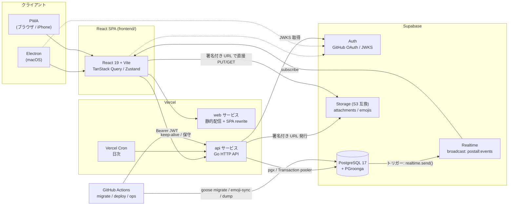
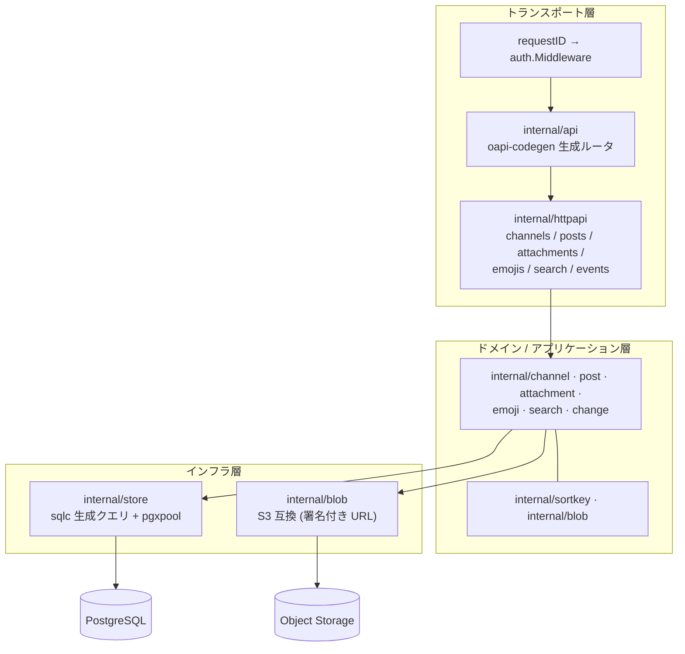
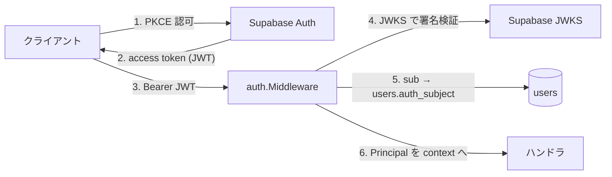
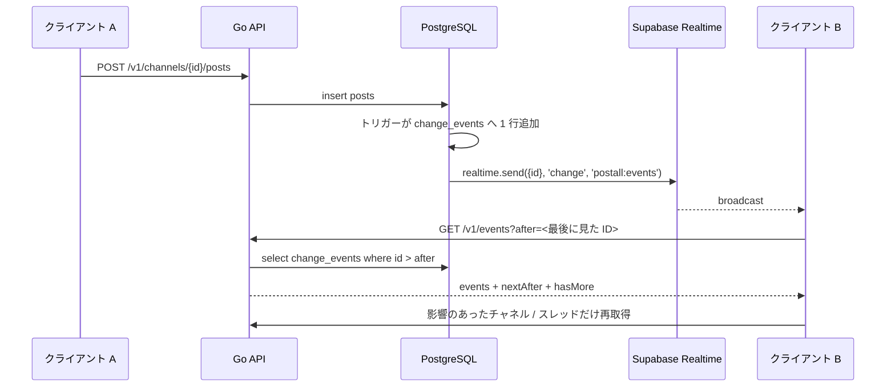
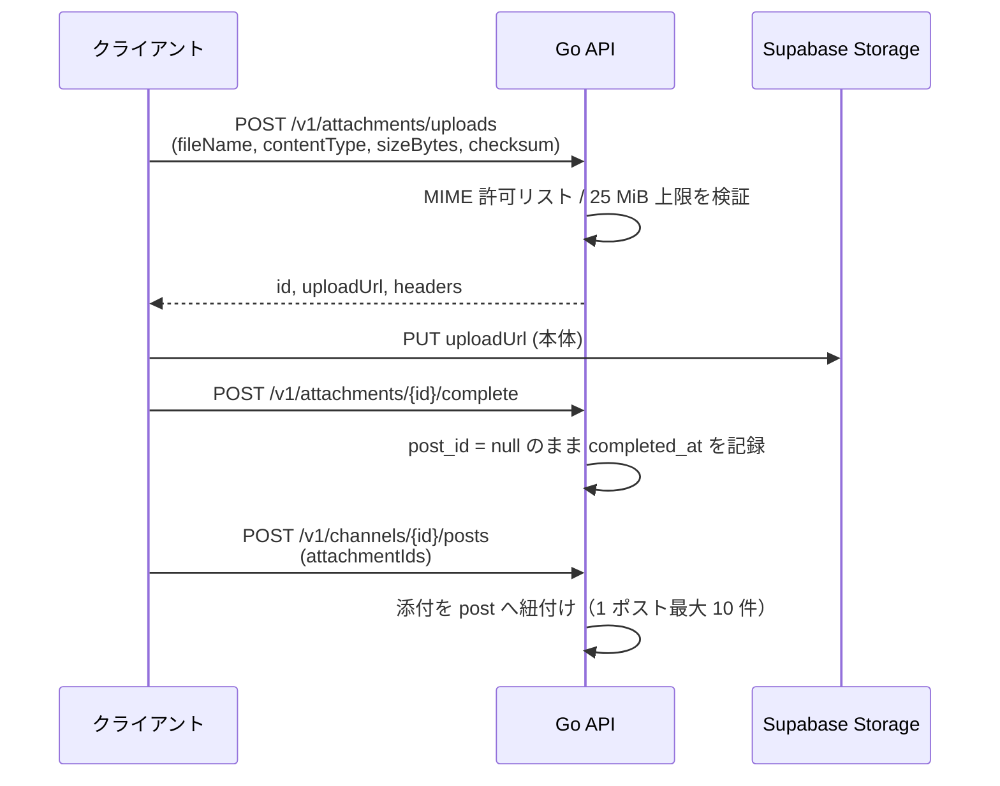

# ARCHITECTURE

PostAll は Slack 風のポスト型メモアプリケーションで、macOS（Electron）とブラウザおよび iPhone の PWA が、Vercel 上の単一の Go API と Supabase（PostgreSQL + Auth + Storage + Realtime）を共有する。iPhone の経路は Safari / ホーム画面 PWA である。

クライアントの契約は `api/openapi.yaml` に一本化し、Go のサーバスタブ（oapi-codegen）と TypeScript の型（openapi-typescript）をそこから生成する。手書きの型定義をクライアントごとに持たないことが、この構成の中心的な制約になっている。

- API 一覧: [API_REFERENCE.md](API_REFERENCE.md)
- テーブル定義: [DATABASE_SCHEMA.md](DATABASE_SCHEMA.md)
- 環境構築: [SETUP_GUIDE.md](SETUP_GUIDE.md)
- 本番デプロイ: [DEPLOYMENT.md](DEPLOYMENT.md)

## システム構成



## 設計方針

### 1. OpenAPI を単一の契約とする

`api/openapi.yaml` が唯一の正で、`make generate` が backend の生成物を作り直す。CI は `git diff --exit-code` で生成物の追従漏れを落とす。frontend は `npm run generate` で `src/api/schema.d.ts` を再生成する。

| 生成先 | ツール | 出力 |
|---|---|---|
| Go | oapi-codegen | `backend/internal/api/openapi.gen.go`（`ServerInterface` とルーティング） |
| TypeScript | openapi-typescript | `frontend/src/api/schema.d.ts`（型のみ。クライアントは手書き） |

TypeScript は「型だけ生成し、HTTP クライアントは手書き」としている。生成 REST クライアントは認証・リトライ・カーソル処理の差し込み口が乏しいため採用していない。

### 2. バックエンドのレイヤー構成



各層の約束事:

- **`internal/httpapi`** — HTTP の入出力とステータスコードだけを持つ。ビジネス判断はサービスへ委譲し、`writeAppError` が各サービスの `*Error`（`Code` / `Message` / `Status` / `Details`）を一貫した JSON へ変換する。
- **`internal/<domain>`** — 検証・順序・権限の判断を持つ。DB アクセスは `store.Queries` インタフェース越し。
- **`internal/store`** — sqlc が `queries/` の SQL から生成する型付きクエリ。手書き SQL はここに集約し、上位層に文字列 SQL を漏らさない。
- **`internal/sortkey`** — チャネル並び替えの分数インデックス。純粋関数で、DB にも HTTP にも依存しない。

### 3. 認証

Supabase Auth の GitHub OAuth に固定し、新規 signup は無効（招待制）。クライアントは PKCE でトークンを取得し、`Authorization: Bearer <JWT>` を API へ送る。



- JWKS は `internal/auth.Verifier` がキャッシュし、未知の `kid` は TTL・クールダウン付きで再取得する（`singleflight` で同時再取得を 1 本に畳む）。JWKS 到達不可は 401 ではなく 503 を返し、鍵配布の一時障害をサインアウト扱いにしない。
- `sub` から `users` 行を解決（無ければ作成）して `Principal{UserID, AuthSubject}` を context に載せる。以降のサービス層は Supabase の概念を知らない。
- 認証をスキップするのは `/health`・`/ready`・`/internal/*` の 4 経路のみ。`/internal/*` は `CRON_SECRET` の Bearer を定数時間比較で検証する。
- トークン保管はプラットフォーム任せ: Electron は `safeStorage`、ブラウザは永続ストレージへ平文で置かない。

### 4. 変更同期（SSE を使わない理由）

Vercel の関数実行時間の制約下で長時間接続を維持できないため、SSE や WebSocket をサーバ側で張らず、**通知（Supabase Realtime）と取得（HTTP）を分離**している。



- Realtime のペイロードはイベント ID のみで、本文を載せない。購読者は必ず API 経由で取り直すため、RLS を通さない経路でデータが漏れる余地を作らない。
- 初回接続は `after=latest`。履歴を 0 番から走査しない。
- Realtime が切れたら 15 秒間隔のポーリングへ退避し、指数バックオフで再接続する（`frontend/src/hooks/useChangeSync.ts`）。
- 通知は**ベストエフォート**。`postall_notify_change_event()` は `realtime.send` の失敗を握り潰し、`postall_notify_failures` に日次カウントだけ残す。通知の失敗で本体の書き込みをロールバックしない。
- `change_events` は 30 日保持。`POST /internal/events/prune` が古い行を削除し、削除済み最大 ID を `change_event_retention` に記録する。保持期間外のカーソルには `resetRequired: true` を返し、クライアントは表示中データを全再取得して復旧する。

### 5. 添付とオブジェクトストレージ

本体をアプリサーバに通さず、署名付き URL でクライアントが直接 Storage とやり取りする。Vercel のリクエストボディ上限とメモリを避けるため。



- ポストに紐付かないまま 1 時間経過した添付は、`POST /internal/attachments/reap` が回収する。ポスト削除時は DB トリガーが `post_id` を null に落として `deletion_pending_at` を立て、同じ回収処理が Storage の実体を消す。
- ダウンロードも短期の署名付き URL（`GET /v1/attachments/{id}/download`）で、Storage を直接公開しない。

### 6. データベース接続

Supabase の接続経路を用途で使い分ける。ここを取り違えると本番でだけ落ちる。

| 用途 | 経路 | 理由 |
|---|---|---|
| API（Vercel） | Transaction pooler（6543） | サーバレスの短命接続に合う |
| migrate / emoji-sync / db dump | Session pooler（`*.pooler.supabase.com:5432`） | goose のセッション状態が必要。かつ IPv4 で到達できる |
| Direct（`db.<ref>.supabase.co:5432`） | 使わない | IPv6 専用。GitHub-hosted runner から届かない |

Transaction pooling に合わせて `internal/httpapi` は pgxpool を `MaxConns = 2`、`DefaultQueryExecMode = QueryExecModeExec` で構成する。名前付きプリペアドは `42P05`、`DescribeExec` の 2 往復は無名プリペアドの `26000` を起こすため使わず、`uuid[]` は接続時に Go 型を登録してエンコードする。

### 7. カスタム絵文字の登録経路は 2 つ

カタログへの登録は次の 2 経路で、どちらも `emojis` テーブルと絵文字バケットに同じ形の行とオブジェクトを作る。登録経路による扱いの差は無い。

| 経路 | 実行者 | 対応形式 | `storage_key` |
|---|---|---|---|
| `postall-server emoji-sync`（`emoji/` の一括登録） | デプロイ工程（`migrate` workflow の後段） | png のみ | `emoji/` 内のファイル名 |
| `POST /v1/emojis`（ピッカーからのアップロード） | サインイン済みユーザー | PNG / GIF、512 KiB 以下 | `emojis/<uuid>.<ext>` |

一括登録を起動時に走らせない方針（起動時間と副作用の分離）は変えていない。要求経路が加わったのは「利用者がその場でスタンプを増やせること」を成り立たせるためで、実体は API サーバが受け取って検証し（形式は先頭のシグネチャで判定）Storage へ置く。添付が署名付き URL を使うのに対しこちらが API を通すのは、実体が小さく、かつ「実体を置く」と「カタログ行を作る」を 1 要求で確定させたいため。

保存キーを経路ごとに分けているのは、重複したショートコードの登録要求が既存スタンプの実体を上書きしないようにするため。`emoji/` に既存ショートコードと同名の png が後から入った場合は、従来どおりリポジトリ側の内容が勝つ。

### 8. 全文検索

PGroonga（`pgroonga_text_regexp_ops_v2`）で `posts.body` を検索する。日本語の分かち書きを前提にせず部分一致が効くこと、Supabase の拡張として使えることが選定理由。索引はクラッシュで壊れることがあり、その場合は `REINDEX INDEX posts_body_pgroonga;` で作り直す。

検索結果はスレッド返信にも当たるため、`timelinePostId`（タイムラインに表示すべきルートポスト）を併せて返し、クライアントは `GET /v1/channels/{id}/posts?around=` で該当箇所の前後を復元する。

### 9. 多層防御としての RLS

Supabase の Data API（PostgREST）は `public` スキーマを公開し、クライアントは publishable key と `authenticated` ロールの JWT を持つ。放置すると Go API の認可を迂回して直接読み書きできてしまうため、マイグレーション `00013_public_schema_lockdown.sql` で全テーブルの RLS を有効化し、`anon` / `authenticated` から `public` スキーマの権限を剥がしている。アプリケーションは常に Go API 経由でのみ DB に触れる。

`realtime.messages` に対しては、`postall:events` トピックの broadcast だけを `authenticated` に許す SELECT ポリシーを置く（`00011_realtime_rls.sql`）。`using (true)` は他トピックの購読を許すため使わない。

### 10. 可用性とスケール

個人利用規模（Vercel Hobby + Supabase Free）を前提とし、水平スケールではなく**無料枠内で落ちないこと**を優先している。

- ステートレスな API。セッションはすべて JWT に載る。
- Supabase Free の自動 pause を避けるため、GitHub Actions の `ops` workflow が 6 時間ごとに保守エンドポイントを叩き keep-alive を兼ねる。
- 保守処理（添付回収・イベント整理）は Vercel Cron（日次）と GitHub Actions（6 時間ごと）の二重化。どちらか一方が止まっても回収が止まらない。
- 日次で `public` スキーマのデータを dump し、gzip + GPG AES-256 で暗号化して Actions のアーティファクトに 30 日残す。

## ディレクトリ構成

```
PostAll/
├── api/openapi.yaml   # 3 クライアント共通の契約。すべての生成物の起点
├── backend/           # Go HTTP API（Vercel の api サービス）
│   ├── cmd/postall-server/  # エントリポイント。server / migrate / migrate-check / emoji-sync
│   ├── internal/api/        # oapi-codegen 生成物（編集しない）
│   ├── internal/httpapi/    # HTTP ハンドラ、エラー変換、リクエスト ID
│   ├── internal/auth/       # JWT 検証（JWKS）と認証ミドルウェア
│   ├── internal/channel/    # チャネル階層・並び替えのドメインロジック
│   ├── internal/post/       # ポスト / スレッド / keyset ページング
│   ├── internal/attachment/ # 添付のライフサイクル、MIME・サイズ制限
│   ├── internal/emoji/      # カスタム絵文字カタログとリアクション
│   ├── internal/search/     # PGroonga 検索とカーソル
│   ├── internal/change/     # 変更イベントの取得と保持期間整理
│   ├── internal/sortkey/    # 分数インデックス（並び替えの純粋関数）
│   ├── internal/blob/       # S3 互換ストレージと署名付き URL
│   ├── internal/store/      # sqlc 生成クエリと pgxpool
│   ├── internal/migrate/    # goose のラッパ
│   ├── internal/testutil/   # testcontainers による PostgreSQL 起動
│   └── migrations/          # goose マイグレーション（スキーマの正）
├── frontend/          # React 19 + Vite + Tailwind v4 + shadcn/ui
│   └── src/
│       ├── api/            # 生成型と手書き HTTP クライアント
│       ├── auth/           # PKCE、セッション、AuthProvider
│       ├── platform/       # ブラウザ / Electron の差異を吸収する抽象
│       ├── hooks/          # useChangeSync / usePosts / useSearch 等
│       ├── state/          # Zustand（UI 状態・接続設定）
│       ├── lib/            # Markdown、Mermaid、日付、添付、Realtime
│       ├── components/     # 機能単位（channels / timeline / thread / ...）
│       └── pwa/            # Service Worker 登録と更新導線
├── electron/          # メインプロセス、preload、electron-builder 設定
├── emoji/             # カスタム絵文字 png の初期セット（emoji-sync が Storage と DB へ同期）
├── supabase/          # ローカルスタック設定。スキーマ本体は置かない
└── openspec/          # 仕様と change 管理
```

## クライアント間の責務分担

frontend の React コードは Electron と PWA で完全に共有し、差異は `frontend/src/platform/` の抽象で吸収する（`browser.ts` / `electron.ts` を `create.ts` が選択し、テストでは `fake.ts` を使う）。認証リダイレクト URI、トークン保管、外部リンクの開き方がここに集約される。

iPhone では同じ React シェルを PWA として配信し、768px 未満ではチャネル一覧 → タイムライン → スレッドの階層画面、それ以上では 3 ペインになる。

| 関心事 | Electron（macOS） | PWA（ブラウザ / iPhone） |
|---|---|---|
| 状態管理 | TanStack Query + Zustand | TanStack Query + Zustand |
| トークン保管 | `safeStorage` | origin の `localStorage`（永続ストレージへ平文で置かない） |
| 接続設定 | `POSTALL_API_BASE_URL` 環境変数 | `VITE_*` 環境変数 |
| リダイレクト URI | `postall://auth/callback` | `https://memo.sudabon.com/auth/callback` |
