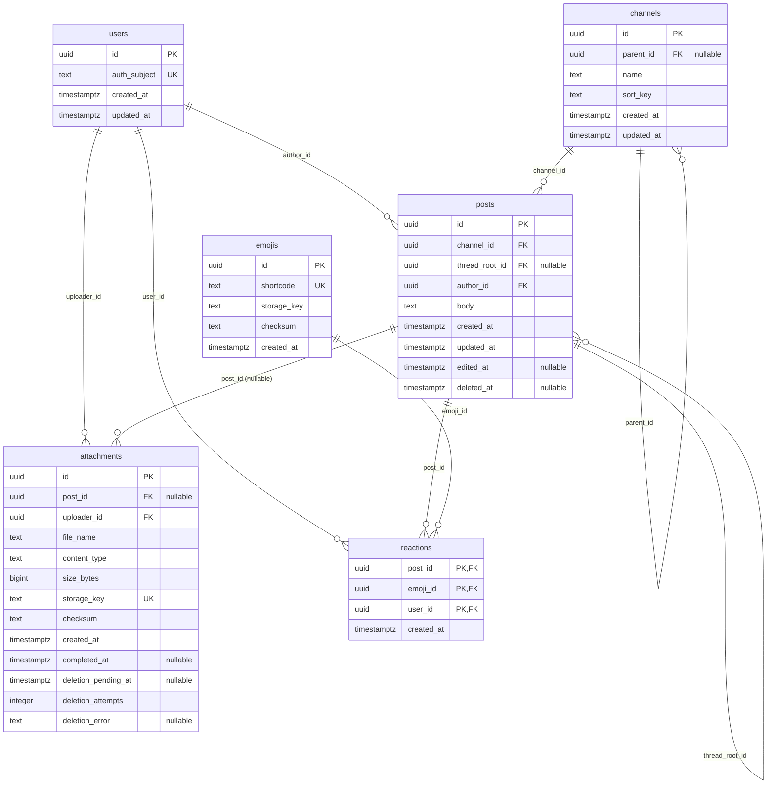
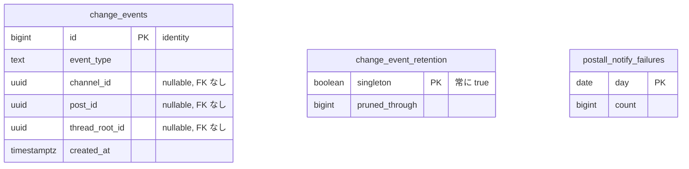

# DATABASE SCHEMA

PostgreSQL 17（Supabase）。**スキーマの正は `backend/migrations/` の goose マイグレーション**で、`supabase/migrations` には置かない（`supabase/config.toml` の `db.seed.enabled = false`）。

`backend/internal/store/schema.sql` は sqlc がコード生成に使う統合済みスキーマで、マイグレーションの結果と一致させて手で維持する。CI は `go tool sqlc generate` の結果を `git diff --exit-code` で検査する。

適用: `cd backend && DATABASE_URL=… go run ./cmd/postall-server migrate`

## ER 図



変更イベント系のテーブルは、上の 6 テーブルとは外部キーで繋がらない（イベント行は参照先が消えても残す）。



## テーブル定義

### users — 利用者

`00001_users.sql`, `00010_auth_subject.sql`

| カラム | 型 | NULL | 制約 |
|---|---|---|---|
| `id` | uuid | NOT NULL | PK, default `gen_random_uuid()` |
| `auth_subject` | text | NOT NULL | UNIQUE（`users_auth_subject_key`） |
| `created_at` | timestamptz | NOT NULL | default `now()` |
| `updated_at` | timestamptz | NOT NULL | default `now()` |

`auth_subject` は Supabase Auth の JWT `sub`。認証ミドルウェアがここから内部 `users.id` を解決し、無ければ作成する。当初 `cognito_sub` だった列を `00010` で改名した（認証基盤の切り替えに伴う）ため、この列名に認証プロバイダ固有の意味を持たせない。

> Supabase Auth のユーザー本体（`auth.users`）は別スキーマにあり、`public` スキーマのバックアップには含まれない。

### channels — チャネル（階層）

`00002_channels.sql`

| カラム | 型 | NULL | 制約 |
|---|---|---|---|
| `id` | uuid | NOT NULL | PK, default `gen_random_uuid()` |
| `parent_id` | uuid | NULL | FK → `channels(id)` ON DELETE CASCADE |
| `name` | text | NOT NULL | CHECK `btrim(name) <> ''` |
| `sort_key` | text | NOT NULL | |
| `created_at` | timestamptz | NOT NULL | default `now()` |
| `updated_at` | timestamptz | NOT NULL | default `now()` |

| インデックス | 種別 | 定義 |
|---|---|---|
| `channels_name_in_parent` | UNIQUE（部分） | `(parent_id, name) WHERE parent_id IS NOT NULL` |
| `channels_name_at_root` | UNIQUE（部分） | `(name) WHERE parent_id IS NULL` |
| `channels_parent_sort` | BTREE | `(parent_id, sort_key)` |

同名チェックを部分ユニークインデックス 2 本に分けているのは、PostgreSQL のユニーク制約では `parent_id IS NULL` の行同士が重複と判定されないため。ルート直下の重複はこれで防ぐ。

`sort_key` は分数インデックス（`backend/internal/sortkey`）で、辞書順が表示順になる。挿入時に前後のキーの中間文字列を生成するため、並び替えで他行を書き換えない。

自己参照 FK は自己ループ・循環を防げないので、親付け替えの検証は `channel.Service`（`cycle` エラー）が行う。

### posts — ポストと返信

`00003_posts.sql`, `00008_pgroonga.sql`

| カラム | 型 | NULL | 制約 |
|---|---|---|---|
| `id` | uuid | NOT NULL | PK, default `gen_random_uuid()` |
| `channel_id` | uuid | NOT NULL | FK → `channels(id)` ON DELETE CASCADE |
| `thread_root_id` | uuid | NULL | FK → `posts(id)`。null ならタイムライン直下 |
| `author_id` | uuid | NOT NULL | FK → `users(id)` |
| `body` | text | NOT NULL | default `''` |
| `created_at` | timestamptz | NOT NULL | default `now()` |
| `updated_at` | timestamptz | NOT NULL | default `now()` |
| `edited_at` | timestamptz | NULL | 編集時に記録 |
| `deleted_at` | timestamptz | NULL | 論理削除 |

| インデックス | 種別 | 定義 |
|---|---|---|
| `posts_timeline` | BTREE（部分） | `(channel_id, created_at, id) WHERE thread_root_id IS NULL AND deleted_at IS NULL` |
| `posts_thread` | BTREE（部分） | `(thread_root_id, created_at, id) WHERE deleted_at IS NULL` |
| `posts_body_pgroonga` | PGroonga | `body pgroonga_text_regexp_ops_v2` |

`(created_at, id)` の複合が keyset ページングのカーソルに対応する。`created_at` の同値を `id` で決定的に割るため、カーソルが行を飛ばしたり重複させたりしない。

削除は `deleted_at` を立てるだけ。返信が残るスレッド親は API 上 `deleted: true` のプレースホルダとして返り、スレッドの繋がりが切れない。

`body` の空文字は許容する（添付のみのポスト）。本文と添付の両方が空であることの禁止は `post.Service` 側（`empty_content`）で判断する。

PGroonga 索引はクラッシュで壊れることがある。その場合は `REINDEX INDEX posts_body_pgroonga;`（実索引名は `\d posts` で確認）。

### attachments — 添付

`00004_attachments.sql`, `00007_attachment_cleanup.sql`

| カラム | 型 | NULL | 制約 |
|---|---|---|---|
| `id` | uuid | NOT NULL | PK, default `gen_random_uuid()` |
| `post_id` | uuid | NULL | FK → `posts(id)` **ON DELETE SET NULL** |
| `uploader_id` | uuid | NOT NULL | FK → `users(id)` |
| `file_name` | text | NOT NULL | |
| `content_type` | text | NOT NULL | 許可 MIME は `attachment.Allowed` |
| `size_bytes` | bigint | NOT NULL | 上限 25 MiB は `attachment.MaxBytes` |
| `storage_key` | text | NOT NULL | UNIQUE。Storage 上のキー |
| `checksum` | text | NOT NULL | SHA-256 hex |
| `created_at` | timestamptz | NOT NULL | default `now()` |
| `completed_at` | timestamptz | NULL | アップロード完了時刻 |
| `deletion_pending_at` | timestamptz | NULL | 実体削除の待ち行列 |
| `deletion_attempts` | integer | NOT NULL | default `0` |
| `deletion_error` | text | NULL | 最後の削除失敗理由 |

| インデックス | 種別 | 定義 |
|---|---|---|
| `attachments_post_id` | BTREE | `(post_id)` |
| `attachments_incomplete` | BTREE（部分） | `(created_at) WHERE post_id IS NULL` |
| `attachments_deletion_pending` | BTREE（部分） | `(deletion_pending_at, id) WHERE deletion_pending_at IS NOT NULL` |

ライフサイクル: `post_id IS NULL` の行は「アップロード中」か「回収待ち」のいずれか。1 時間（`attachment.IncompleteAge`）を超えて紐付かない行と、`deletion_pending_at` が立った行を `POST /internal/attachments/reap` が Storage の実体ごと片付ける。

FK を CASCADE ではなく SET NULL にしているのは、行ごと消すと Storage 上の実体が孤児になるため。削除を DB のカスケードに任せず、回収キューを経由させる。

### emojis — カスタム絵文字

`00005_emojis_reactions.sql`

| カラム | 型 | NULL | 制約 |
|---|---|---|---|
| `id` | uuid | NOT NULL | PK, default `gen_random_uuid()` |
| `shortcode` | text | NOT NULL | UNIQUE, CHECK `shortcode <> ''` |
| `storage_key` | text | NOT NULL | Storage 上のキー |
| `checksum` | text | NOT NULL | ETag に流用 |
| `created_at` | timestamptz | NOT NULL | default `now()` |

カタログの正はリポジトリの `emoji/` ディレクトリ。`postall-server emoji-sync` が png を Storage へ上げ、この表を作成・更新する（本番では `migrate` workflow の後段ジョブ）。

### reactions — リアクション

`00005_emojis_reactions.sql`

| カラム | 型 | NULL | 制約 |
|---|---|---|---|
| `post_id` | uuid | NOT NULL | PK（複合）, FK → `posts(id)` ON DELETE CASCADE |
| `emoji_id` | uuid | NOT NULL | PK（複合）, FK → `emojis(id)` ON DELETE CASCADE |
| `user_id` | uuid | NOT NULL | PK（複合）, FK → `users(id)` ON DELETE CASCADE |
| `created_at` | timestamptz | NOT NULL | default `now()` |

複合主キーが「1 ユーザー・1 ポスト・1 絵文字につき 1 行」を保証するため、`PUT` は冪等に書ける。集計順（API の `reactions` 配列）は最初に付与された `created_at` 順。

### change_events — 変更イベント

`00006_search_events.sql`, `00015_change_event_retention.sql`

| カラム | 型 | NULL | 制約 |
|---|---|---|---|
| `id` | bigint | NOT NULL | PK, `generated always as identity` |
| `event_type` | text | NOT NULL | CHECK（下記 10 種） |
| `channel_id` | uuid | NULL | FK なし |
| `post_id` | uuid | NULL | FK なし |
| `thread_root_id` | uuid | NULL | FK なし |
| `created_at` | timestamptz | NOT NULL | default `now()` |

インデックス: `change_events_created_at (created_at)`（保持期間の刈り取り用）。カーソル走査は PK を使う。

`event_type` の許容値: `channel.created` `channel.updated` `channel.deleted` `post.created` `post.updated` `post.deleted` `reply.created` `reply.updated` `reply.deleted` `reaction.updated`

参照先へ FK を張らないのは、削除イベントの行が削除対象の消滅で道連れにならないようにするため。`id` は単調増加でクライアントのカーソルになる（API では十進文字列として返す）。

### change_event_retention — 刈り取り済み位置

`00015_change_event_retention.sql`

| カラム | 型 | NULL | 制約 |
|---|---|---|---|
| `singleton` | boolean | NOT NULL | PK, default `true`, CHECK `singleton`（必ず 1 行） |
| `pruned_through` | bigint | NOT NULL | default `0`, CHECK `>= 0` |

削除済みの最大イベント ID を記録する 1 行だけの表。これが無いと、クライアントのカーソルが「まだ来ていない ID」なのか「刈り取られた ID」なのか区別できず、通常の ID 欠番を期限切れと誤判定して不要な全再取得（`resetRequired`）を起こす。

### postall_notify_failures — 通知失敗カウンタ

`00014_notify_failure_counter.sql`

| カラム | 型 | NULL | 制約 |
|---|---|---|---|
| `day` | date | NOT NULL | PK |
| `count` | bigint | NOT NULL | default `0` |

Realtime 通知の失敗を日次で数えるだけの運用用テーブル。アプリケーションからは読まないため `internal/store/schema.sql`（sqlc）には含まない。

## 関数とトリガー

| 関数 | トリガー | 対象 | タイミング | 役割 |
|---|---|---|---|---|
| `postall_record_channel_change()` | `channels_record_change` | channels | AFTER INSERT/UPDATE/DELETE | `channel.*` イベントを記録 |
| `postall_record_post_change()` | `posts_record_change` | posts | AFTER INSERT/UPDATE | `thread_root_id` の有無で `post.*` / `reply.*` を出し分け、`deleted_at` が立った遷移を `*.deleted` にする |
| `postall_record_reaction_change()` | `reactions_record_change` | reactions | AFTER INSERT/DELETE | 対象ポストを引いて `reaction.updated` を記録 |
| `postall_notify_change_event()` | `change_events_notify` | change_events | AFTER INSERT | `realtime.send({id}, 'change', 'postall:events', true)` で通知 |
| `mark_post_attachments_for_deletion()` | `posts_mark_attachments_for_deletion` | posts | BEFORE DELETE | 添付の `post_id` を外し `deletion_pending_at` を立てる |

`postall_notify_change_event()` は `00006` の `pg_notify` から `00009` で Realtime broadcast へ移り、`00012` で全例外を握り潰すベストエフォートになり、`00014` で失敗の日次計数が加わった。**通知の失敗で本体の書き込みをロールバックしない**ことが一貫した方針で、計数の失敗自体も独立したサブトランザクションで握り潰す（例外ハンドラ内のエラーは同じブロックでは捕捉できないため）。

`realtime` スキーマが無い環境（testcontainers の素の PostgreSQL）でも動くよう、`undefined_function` / `invalid_schema_name` に限らず全 SQLSTATE を warning にして続行する。

## Row Level Security と権限

`00013_public_schema_lockdown.sql` が `users` `channels` `posts` `attachments` `emojis` `reactions` `change_events` の RLS を有効化し、`anon` / `authenticated` から `public` スキーマの USAGE と全オブジェクト権限を剥がす。`00014` / `00015` で追加した 2 表も同様に RLS 有効・権限剥奪。

理由: Supabase の Data API（PostgREST）は `public` スキーマを公開し、クライアントは publishable key と `authenticated` ロールの JWT を持つ。締めないと Go API の認可を迂回して直接読み書きできる。**ポリシーを 1 本も定義していない**のは意図的で、アプリケーションは常に Go API（接続ロールは `postgres`）経由でのみ DB に触れる。

`anon` / `authenticated` は Supabase 固有のロールで素の PostgreSQL には存在しないため、`pg_roles` の存在確認付きで `revoke` する（testcontainers でも同じマイグレーションが通る）。

Realtime 側は `00011_realtime_rls.sql` が `realtime.messages` に SELECT ポリシーを 1 本置く。

```sql
create policy postall_events_select
    on realtime.messages
    for select to authenticated
    using (realtime.topic() = 'postall:events' and extension = 'broadcast');
```

`using (true)` は他トピックの購読を許すため使わない。ホスト環境では `realtime.messages` の所有者が `supabase_admin` で、`postgres` からの `CREATE POLICY` が `42501` になることがある。マイグレーションは止めず notice を出して継続するので、その場合は Supabase の SQL Editor で同じ文を適用する。

## 運用メモ

| 項目 | 内容 |
|---|---|
| 拡張 | `pgcrypto`（`gen_random_uuid`）、`pgroonga`（全文検索） |
| 接続 | API は Transaction pooler（6543）。migrate / emoji-sync / dump は Session pooler（`*.pooler.supabase.com:5432`）。Direct は IPv6 専用で使わない |
| プリペアド | API は `QueryExecModeExec`（1 往復）。名前付きは `42P05`、`DescribeExec` は無名プリペアドの `26000` を起こす。`uuid[]` は接続時に型登録する |
| 保持期間 | `change_events` は 30 日。日次・6 時間ごとの `prune` が刈り取る |
| バックアップ | 日次 `supabase db dump --data-only --schema public` を gzip + GPG AES-256 で暗号化し 30 日保持。`goose_db_version` は除外済みなので、復元先は空 DB へ goose migrate 後に流し込む |
| バックアップ対象外 | `auth.users`（Supabase Auth）と Storage の実体（添付・絵文字） |
| 容量 | Supabase Free は DB 500 MB / Storage 1 GB |
